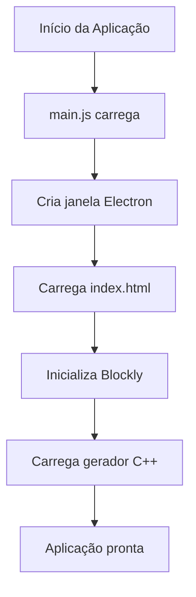
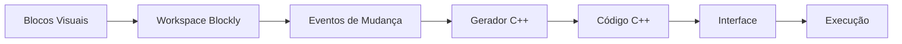
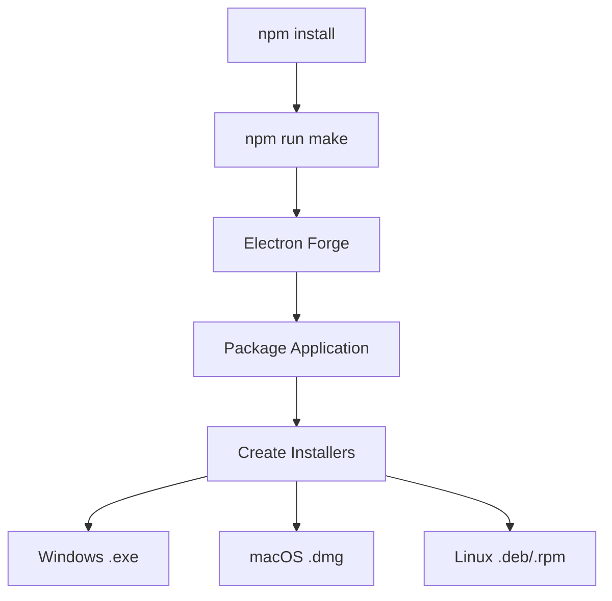
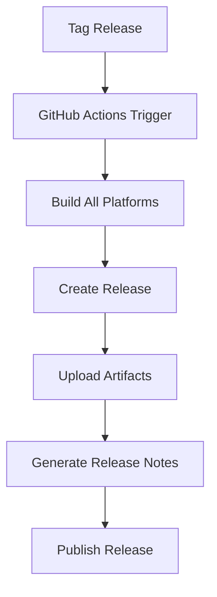

# Guia Técnico Completo - IdeiaSpace Mission

## 📋 Índice

1. [Visão Geral da Arquitetura](#visão-geral-da-arquitetura)
2. [Fluxo de Execução](#fluxo-de-execução)
3. [Tecnologias e Bibliotecas](#tecnologias-e-bibliotecas)
4. [Estrutura de Dados](#estrutura-de-dados)
5. [Interface Gráfica](#interface-gráfica)
6. [Geração de Código](#geração-de-código)
7. [Sistema de Eventos](#sistema-de-eventos)
8. [Processo de Build](#processo-de-build)
9. [Deploy e Distribuição](#deploy-e-distribuição)
10. [Roadmap e Novas Features](#roadmap-e-novas-features)
11. [Referências e Recursos](#referências-e-recursos)

---

## 🏗️ Visão Geral da Arquitetura

O IdeiaSpace Mission é uma aplicação desktop multiplataforma construída com **Electron**, que combina programação visual (Blockly) com geração de código C++. A arquitetura segue o padrão **Model-View-Controller (MVC)** adaptado para aplicações Electron.

### Diagrama de Arquitetura

```
┌─────────────────────────────────────────────────────────────┐
│                    IDEIASpace Mission                       │
├─────────────────────────────────────────────────────────────┤
│  ┌─────────────────┐    ┌─────────────────┐                │
│  │   Main Process  │    │ Renderer Process│                │
│  │   (Node.js)     │◄──►│   (Chromium)    │                │
│  └─────────────────┘    └─────────────────┘                │
│           │                       │                        │
│           ▼                       ▼                        │
│  ┌─────────────────┐    ┌─────────────────┐                │
│  │   IPC Bridge    │    │   Blockly UI    │                │
│  └─────────────────┘    └─────────────────┘                │
│           │                       │                        │
│           ▼                       ▼                        │
│  ┌─────────────────┐    ┌─────────────────┐                │
│  │  Code Generator │    │  Visual Blocks  │                │
│  │     (C++)       │    │   (Blockly)     │                │
│  └─────────────────┘    └─────────────────┘                │
└─────────────────────────────────────────────────────────────┘
```

### Componentes Principais

1. **Main Process** (`src/main/main.js`): Processo principal do Electron
2. **Renderer Process** (`src/renderer/controller/renderer.js`): Controller da interface
3. **View** (`src/renderer/view/index.html`, `style.css`): Arquivos de apresentação
4. **Model** (`src/renderer/model/`): Lógica de negócio da aplicação
   - `blocks.js`: Definição dos blocos customizados
   - `cpp_generator.js`: Gerador de código C++
5. **Assets** (`src/assets/`): Imagens e outros recursos estáticos

---

## 🔄 Fluxo de Execução

### 1. Inicialização da Aplicação



**Detalhamento:**

1. **`src/main/main.js`** - Ponto de entrada:
   ```javascript
   const { app, BrowserWindow } = require('electron');
   const path = require('path');
   
   function createWindow() {
     const mainWindow = new BrowserWindow({
       width: 1200,
       height: 800,
       webPreferences: {
         nodeIntegration: true,
         contextIsolation: false,
         preload: path.join(__dirname, 'preload.js')
       }
     });
     
     mainWindow.loadFile(path.join(__dirname, '../renderer/view/index.html'));
   }
   ```

2. **`src/renderer/view/index.html`** - Carrega recursos:
   ```html
   <link rel="stylesheet" href="./style.css">
   <script src="../../../node_modules/blockly/blockly_compressed.js"></script>
   <script src="../model/cpp_generator.js"></script>
   <script src="../model/blocks.js"></script>
   <script src="../controller/renderer.js"></script>
   ```

3. **`src/renderer/controller/renderer.js`** - Inicializa Blockly:
   ```javascript
   const workspace = Blockly.inject('blocklyDiv', {
     toolbox: document.getElementById('toolbox'),
     scrollbars: true,
     trashcan: true,
     grid: { spacing: 20, length: 3, colour: '#ccc', snap: true },
     zoom: { controls: true, wheel: true, startScale: 1.0 }
   });
   ```

### 2. Fluxo de Geração de Código

```mermaid
graph TD
    A[Usuário arrasta bloco] --> B[Evento BLOCK_CREATE]
    B --> C[Workspace change listener]
    C --> D[generateCode()]
    D --> E[Blockly.Cpp.init()]
    E --> F[Blockly.Cpp.workspaceToCode()]
    F --> G[Processa cada bloco]
    G --> H[Gera código C++]
    H --> I[Exibe no code-display]
```

**Detalhamento:**

1. **Evento de Mudança**:
   ```javascript
   workspace.addChangeListener(function(event) {
     if (event.type === Blockly.Events.BLOCK_CHANGE ||
         event.type === Blockly.Events.BLOCK_CREATE ||
         event.type === Blockly.Events.BLOCK_DELETE ||
         event.type === Blockly.Events.BLOCK_MOVE) {
       generateCode();
     }
   });
   ```

2. **Geração de Código**:
   ```javascript
   function generateCode() {
     try {
       Blockly.Cpp.init();
       const code = Blockly.Cpp.workspaceToCode(workspace);
       codeDisplay.textContent = code || '// Nenhum bloco para gerar código';
       return code;
     } catch (error) {
       console.error('Erro ao gerar código:', error);
       return null;
     }
   }
   ```

### 3. Fluxo de Execução

```mermaid
graph TD
    A[Usuário clica ▶️] --> B[executeCode()]
    B --> C[generateCode()]
    C --> D[ipcRenderer.send('execute-code')]
    D --> E[Main process recebe]
    E --> F[Executa código C++]
    F --> G[Retorna resultado]
    G --> H[ipcRenderer.on('execution-result')]
    H --> I[Exibe resultado]
```

---

## 🛠️ Tecnologias e Bibliotecas

### Core Technologies

#### 1. **Electron** (v27.0.0)
- **Descrição**: Framework para criar aplicações desktop com tecnologias web
- **Documentação**: [electronjs.org/docs](https://www.electronjs.org/docs)
- **GitHub**: [github.com/electron/electron](https://github.com/electron/electron)
- **Uso no projeto**: 
  - `main.js`: Processo principal
  - `renderer.js`: Processo de renderização
  - `preload.js`: Script de pré-carregamento

#### 2. **Blockly** (v10.4.3)
- **Descrição**: Biblioteca Google para programação visual em blocos
- **Documentação**: [developers.google.com/blockly](https://developers.google.com/blockly)
- **GitHub**: [github.com/google/blockly](https://github.com/google/blockly)
- **Uso no projeto**:
  - Interface de programação visual
  - Sistema de blocos customizados
  - Geração de código

#### 3. **Node.js** (v16+)
- **Descrição**: Runtime JavaScript para backend
- **Documentação**: [nodejs.org/docs](https://nodejs.org/docs)
- **Uso no projeto**: 
  - Processo principal do Electron
  - Gerenciamento de dependências
  - Scripts de build

### Dependências Principais

#### Build e Distribuição
```json
{
  "@electron-forge/cli": "^7.2.0",
  "@electron-forge/maker-deb": "^7.2.0",
  "@electron-forge/maker-rpm": "^7.2.0",
  "@electron-forge/maker-squirrel": "^7.2.0",
  "@electron-forge/maker-zip": "^7.2.0"
}
```

#### Desenvolvimento
```json
{
  "electron": "^27.0.0",
  "blockly": "^10.4.3"
}
```

### Referências Externas para Estudo

#### Electron
- [Electron Quick Start](https://www.electronjs.org/docs/tutorial/quick-start)
- [Electron Security](https://www.electronjs.org/docs/tutorial/security)
- [Electron IPC](https://www.electronjs.org/docs/api/ipc-main)
- [Electron Forge](https://www.electronforge.io/)

#### Blockly
- [Blockly Developer Documentation](https://developers.google.com/blockly/guides)
- [Blockly Code Generators](https://developers.google.com/blockly/guides/create-custom-blocks/generating-code)
- [Blockly Custom Blocks](https://developers.google.com/blockly/guides/create-custom-blocks/overview)
- [Blockly Events](https://developers.google.com/blockly/guides/create-custom-blocks/events)

#### C++ Programming
- [C++ Reference](https://en.cppreference.com/)
- [C++ Tutorial](https://www.cplusplus.com/doc/tutorial/)
- [Modern C++](https://isocpp.org/get-started)

---

## 📊 Estrutura de Dados

### 1. Workspace Blockly

```javascript
// Estrutura do workspace
const workspace = {
  topBlocks_: [],           // Blocos de nível superior
  blockDB_: {},             // Banco de dados de blocos
  variableDB_: {},          // Banco de dados de variáveis
  options: {                // Configurações do workspace
    grid: { spacing: 20, length: 3, colour: '#ccc', snap: true },
    zoom: { controls: true, wheel: true, startScale: 1.0 }
  }
};
```

### 2. Blocos Customizados

```javascript
// Estrutura de um bloco customizado
Blockly.Blocks['delay_block'] = {
  init: function() {
    this.appendDummyInput()
        .appendField("delay")
        .appendField(new Blockly.FieldNumber(1000, 0, 60000, 100), "DELAY_TIME")
        .appendField("milliseconds");
    this.setPreviousStatement(true, null);
    this.setNextStatement(true, null);
    this.setColour(230);
    this.setTooltip("Delay execution for specified milliseconds");
  }
};
```

### 3. Gerador C++

```javascript
// Estrutura do gerador
Blockly.Cpp = {
  includes_: {},           // Bibliotecas incluídas
  definitions_: {},        // Definições e variáveis
  functionNames_: {},      // Nomes de funções
  variableDB_: null,       // Banco de dados de variáveis
  ORDER_ATOMIC: 0,         // Ordem de precedência
  ORDER_ADDITIVE: 4,       // Ordem de precedência
  // ... outras constantes
};
```

### 4. Fluxo de Dados



---

## 🎨 Interface Gráfica

### 1. Layout Principal

```html
<!-- Estrutura HTML principal -->
<header class="header">
  
  <h1>Ideia Space Mission</h1>
</header>

<div class="container">
  <div id="blocklyDiv" class="blockly-area"></div>
  <div class="side-panel">
    <h3>🧠 Código C++</h3>
    <pre id="code-display" class="code-box"></pre>
    <div class="monitor-section">
      <button id="startButton">&#9655;</button>
      <p id="message"></p>
    </div>
  </div>
</div>
```

### 2. Estilos CSS

```css
/* Layout responsivo */
.container {
  display: flex;
  height: calc(100vh - 80px);
  gap: 20px;
  padding: 20px;
}

.blockly-area {
  flex: 2;
  border: 2px solid #ddd;
  border-radius: 8px;
  background: #f9f9f9;
}

.side-panel {
  flex: 1;
  display: flex;
  flex-direction: column;
  gap: 20px;
}

.code-box {
  flex: 1;
  background: #1e1e1e;
  color: #d4d4d4;
  padding: 15px;
  border-radius: 8px;
  font-family: 'Consolas', 'Monaco', monospace;
  font-size: 14px;
  overflow-y: auto;
  border: 1px solid #333;
}
```

### 3. Toolbox (Categorias de Blocos)

```xml
<xml id="toolbox" style="display: none">
  <category name="Lógica" colour="#5C81A6">
    <block type="controls_if"></block>
    <block type="logic_compare"></block>
    <block type="logic_operation"></block>
    <block type="logic_boolean"></block>
  </category>
  
  <category name="Loops" colour="#5CA65C">
    <block type="controls_repeat_ext">
      <value name="TIMES">
        <shadow type="math_number"><field name="NUM">10</field></shadow>
      </value>
    </block>
    <block type="controls_whileUntil"></block>
  </category>
  
  <category name="Matemática" colour="#5C68A6">
    <block type="math_number"><field name="NUM">0</field></block>
    <block type="math_arithmetic"></block>
  </category>
  
  <category name="Texto" colour="#5CA68D">
    <block type="text"></block>
    <block type="text_print"></block>
  </category>
  
  <category name="Variáveis" colour="#A65C81" custom="VARIABLE"></category>
  <category name="Funções" colour="#9A5CA6" custom="PROCEDURE"></category>
  
  <category name="Sensores" colour="#FFAA00">
    <block type="delay_block"></block>
    <block type="digital_write"></block>
    <block type="digital_read"></block>
  </category>
</xml>
```

### 4. Responsividade

```css
/* Media queries para diferentes tamanhos de tela */
@media (max-width: 768px) {
  .container {
    flex-direction: column;
    height: auto;
  }
  
  .blockly-area {
    height: 400px;
  }
  
  .side-panel {
    height: 300px;
  }
}

@media (max-width: 480px) {
  .header h1 {
    font-size: 1.5rem;
  }
  
  .code-box {
    font-size: 12px;
  }
}
```

---

## 🔧 Geração de Código

### 1. Arquitetura do Gerador

```javascript
// Estrutura do gerador C++
Blockly.Cpp = new Blockly.Generator('C++');

// Palavras reservadas C++
Blockly.Cpp.addReservedWords(
  'auto,break,case,char,const,continue,default,do,double,else,enum,extern,' +
  'float,for,goto,if,int,long,register,return,short,signed,sizeof,static,' +
  'struct,switch,typedef,union,unsigned,void,volatile,while,cout,cin,endl,' +
  'string,vector,map,set,list,queue,stack,priority_queue,algorithm,iostream,' +
  'fstream,sstream,chrono,thread,mutex,condition_variable,atomic,memory,' +
  'functional,regex,random,complex,valarray,array,tuple,pair,optional,' +
  'variant,any,function,bind,ref,cref,placeholders,make_unique,make_shared'
);
```

### 2. Ordem de Precedência

```javascript
// Ordem de operadores C++
Blockly.Cpp.ORDER_ATOMIC = 0;            // 0 "" ...
Blockly.Cpp.ORDER_UNARY_POSTFIX = 1;     // expr++ expr-- () [] .
Blockly.Cpp.ORDER_UNARY_PREFIX = 2;      // -expr !expr ~expr ++expr --expr
Blockly.Cpp.ORDER_MULTIPLICATIVE = 3;    // * / % ~/
Blockly.Cpp.ORDER_ADDITIVE = 4;          // + -
Blockly.Cpp.ORDER_SHIFT = 5;             // << >>
Blockly.Cpp.ORDER_RELATIONAL = 6;        // >= > <= <
Blockly.Cpp.ORDER_EQUALITY = 7;          // == != === !==
Blockly.Cpp.ORDER_BITWISE_AND = 8;       // &
Blockly.Cpp.ORDER_BITWISE_XOR = 9;       // ^
Blockly.Cpp.ORDER_BITWISE_OR = 10;       // |
Blockly.Cpp.ORDER_LOGICAL_AND = 11;      // &&
Blockly.Cpp.ORDER_LOGICAL_OR = 12;       // ||
Blockly.Cpp.ORDER_CONDITIONAL = 13;      // expr ? expr : expr
Blockly.Cpp.ORDER_ASSIGNMENT = 14;       // = *= /= ~/= %= += -= <<= >>= &= ^= |=
Blockly.Cpp.ORDER_NONE = 99;             // (...)
```

### 3. Geradores de Blocos

#### Bloco IF/ELSE
```javascript
Blockly.Cpp['controls_if'] = function(block) {
  var n = 0;
  var code = '', branchCode, conditionCode;
  do {
    conditionCode = Blockly.Cpp.valueToCode(block, 'IF' + n,
      Blockly.Cpp.ORDER_NONE) || 'false';
    branchCode = Blockly.Cpp.statementToCode(block, 'DO' + n);
    code += (n == 0 ? 'if (' : 'else if (') + conditionCode + ') {\n' + branchCode + '}';
    n++;
  } while (block.getInput('IF' + n));

  if (block.getInput('ELSE')) {
    branchCode = Blockly.Cpp.statementToCode(block, 'ELSE');
    code += ' else {\n' + branchCode + '}';
  }
  return code + '\n';
};
```

#### Bloco Loop
```javascript
Blockly.Cpp['controls_repeat_ext'] = function(block) {
  var repeats = Blockly.Cpp.valueToCode(block, 'TIMES',
    Blockly.Cpp.ORDER_ASSIGNMENT) || '0';
  var branch = Blockly.Cpp.statementToCode(block, 'DO');
  var code = 'for (int i = 0; i < ' + repeats + '; i++) {\n' + branch + '}\n';
  return code;
};
```

#### Bloco Print
```javascript
Blockly.Cpp['text_print'] = function(block) {
  Blockly.Cpp.includes_['iostream'] = '#include <iostream>';
  var msg = Blockly.Cpp.valueToCode(block, 'TEXT',
    Blockly.Cpp.ORDER_NONE) || '""';
  return 'std::cout << ' + msg + ' << std::endl;\n';
};
```

### 4. Estrutura do Código Gerado

```cpp
// Exemplo de código gerado
#include <iostream>
#include <chrono>
#include <thread>

void minhaFuncao() {
  std::cout << "Hello World!" << std::endl;
}

int main() {
  int contador = 0;
  
  for (int i = 0; i < 5; i++) {
    std::cout << "Iteração: " << i << std::endl;
    std::this_thread::sleep_for(std::chrono::milliseconds(1000));
    contador = contador + 1;
  }
  
  if (contador > 3) {
    std::cout << "Contador é maior que 3" << std::endl;
  }
  
  return 0;
}
```

---

## 📡 Sistema de Eventos

### 1. Eventos Blockly

```javascript
// Tipos de eventos Blockly
Blockly.Events.BLOCK_CHANGE    // Bloco modificado
Blockly.Events.BLOCK_CREATE    // Bloco criado
Blockly.Events.BLOCK_DELETE    // Bloco deletado
Blockly.Events.BLOCK_MOVE      // Bloco movido
Blockly.Events.VARIABLE_CREATE // Variável criada
Blockly.Events.VARIABLE_DELETE // Variável deletada
Blockly.Events.VARIABLE_RENAME // Variável renomeada
```

### 2. Listener de Mudanças

```javascript
// Listener para mudanças no workspace
workspace.addChangeListener(function(event) {
  if (event.type === Blockly.Events.BLOCK_CHANGE ||
      event.type === Blockly.Events.BLOCK_CREATE ||
      event.type === Blockly.Events.BLOCK_DELETE ||
      event.type === Blockly.Events.BLOCK_MOVE) {
    generateCode();
  }
});
```

### 3. Eventos Electron IPC

```javascript
// Renderer process -> Main process
ipcRenderer.send('execute-code', code);

// Main process -> Renderer process
ipcRenderer.on('execution-result', (event, result) => {
  messageElement.textContent = result.success ? 
    'Código executado com sucesso!' : 'Erro: ' + result.error;
  startButton.disabled = false;
});
```

### 4. Eventos de Interface

```javascript
// Evento de clique no botão
startButton.addEventListener('click', executeCode);

// Evento de teclado
document.addEventListener('keydown', function(event) {
  if (event.ctrlKey && event.key === 's') {
    event.preventDefault();
    saveWorkspace();
  }
});
```

---

## 🏗️ Processo de Build

### 1. Configuração Electron Forge

```javascript
// forge.config.js
module.exports = {
  packagerConfig: {
    asar: true,
    icon: 'src/assets/logo.png',
    name: 'IdeiaSpace Mission',
    overwrite: true
  },
  rebuildConfig: {},
  makers: [
    {
      name: '@electron-forge/maker-squirrel',
      config: {},
    },
    {
      name: '@electron-forge/maker-zip',
      platforms: ['darwin'],
    },
    {
      name: '@electron-forge/maker-deb',
      config: {},
    },
    {
      name: '@electron-forge/maker-rpm',
      config: {},
    },
  ],
};
```

### 2. Scripts de Build

```json
// package.json
{
  "main": "src/main/main.js",
  "scripts": {
    "start": "electron-forge start",
    "package": "electron-forge package",
    "make": "electron-forge make",
    "publish": "electron-forge publish"
  }
}
```

### 3. Processo de Build



### 4. GitHub Actions CI/CD

```yaml
# .github/workflows/build.yml
name: Build and Release

on:
  push:
    branches:
      - main
    tags:
      - 'v*'
  pull_request:
    branches: [ main, develop ]

jobs:
  build:
    runs-on: ${{ matrix.os }}
    strategy:
      matrix:
        os: [windows-latest, macos-latest, ubuntu-latest]
        node-version: [16, 18]

    steps:
    - name: Checkout code
      uses: actions/checkout@v4

    - name: Setup Node.js ${{ matrix.node-version }}
      uses: actions/setup-node@v4
      with:
        node-version: ${{ matrix.node-version }}
        cache: 'npm'

    - name: Install dependencies
      run: npm ci

    - name: Run linting
      run: npm run lint

    - name: Build application
      run: npm run make
      env:
        GITHUB_TOKEN: ${{ secrets.GITHUB_TOKEN }}

    - name: Upload build artifacts
      uses: actions/upload-artifact@v4
      with:
        name: ideiaspace-mission-${{ matrix.os }}-${{ matrix.node-version }}
        path: out/
        retention-days: 30
```

---

## 🚀 Deploy e Distribuição

### 1. Estrutura de Distribuição

```
out/
├── ideiaspace-mission-win32-x64/
│   ├── IdeiaSpace Mission.exe
│   ├── resources/
│   └── locales/
├── ideiaspace-mission-darwin-x64/
│   ├── IdeiaSpace Mission.app
│   └── Contents/
└── ideiaspace-mission-linux-x64/
    ├── ideiaspace-mission
    └── resources/
```

### 2. Processo de Release



### 3. Versionamento

```json
// package.json
{
  "name": "ideiaspace-mission",
  "version": "1.0.0",
  "description": "Visual programming environment for C++",
  "main": "src/main/main.js",
  "author": "IdeiaSpace Team",
  "license": "MIT"
}
```

### 4. Configuração de Ambiente

```bash
# env.example
# Configurações da aplicação
APP_NAME=IdeiaSpace Mission
APP_VERSION=1.0.0

# Configurações do GitHub
GITHUB_TOKEN=seu_token_aqui
GITHUB_REPO=seu-usuario/ideiaspace-mission

# Configurações de build
BUILD_TARGET=win32,linux,darwin
```

---

## 🎯 Roadmap e Novas Features

### Versão 1.1 (Próxima Release)

#### 🎨 Interface e UX
- [ ] **Tema Escuro/Claro**
  - Toggle de tema na interface
  - Persistência de preferência
  - Cores adaptativas para Blockly

- [ ] **Zoom e Navegação Melhorada**
  - Sensores de zoom mais intuitivos
  - Mini-map do workspace
  - Navegação por teclado

- [ ] **Layout Responsivo Avançado**
  - Suporte a telas 4K
  - Layout adaptativo para tablets
  - Modo compacto para telas pequenas

#### 🔧 Funcionalidades C++
- [ ] **Suporte a Classes**
  ```cpp
  class MinhaClasse {
  private:
    int valor;
  public:
    void setValor(int v) { valor = v; }
    int getValor() { return valor; }
  };
  ```

- [ ] **Templates C++**
  ```cpp
  template<typename T>
  T maximo(T a, T b) {
    return (a > b) ? a : b;
  }
  ```

- [ ] **STL Containers**
  - Vector, Map, Set, List
  - Iteradores e algoritmos
  - Smart pointers

#### 🐛 Debugging
- [ ] **Debugger Visual**
  - Breakpoints nos blocos
  - Step-by-step execution
  - Variáveis inspector
  - Call stack visualization

- [ ] **Error Handling**
  - Validação de blocos em tempo real
  - Sugestões de correção
  - Error highlighting

### Versão 1.2 (Médio Prazo)

#### 📚 Bibliotecas Externas
- [ ] **Gerenciador de Bibliotecas**
  - Interface para adicionar/remover bibliotecas
  - Auto-download de dependências
  - Versionamento de bibliotecas

- [ ] **Bibliotecas Populares**
  - Boost
  - OpenCV
  - SFML
  - Qt (para GUI)

#### 🔍 Análise de Código
- [ ] **Static Analysis**
  - Detecção de memory leaks
  - Análise de complexidade
  - Sugestões de otimização

- [ ] **Code Metrics**
  - Complexidade ciclomática
  - Linhas de código
  - Cobertura de testes

#### 🎮 Gamificação
- [ ] **Sistema de Conquistas**
  - Badges por funcionalidades usadas
  - Progress tracking
  - Leaderboards

- [ ] **Tutoriais Interativos**
  - Guias passo-a-passo
  - Exemplos práticos
  - Desafios progressivos

### Versão 2.0 (Longo Prazo)

#### 🌐 Múltiplas Linguagens
- [ ] **Suporte a Outras Linguagens**
  - Python
  - JavaScript
  - Java
  - Rust

- [ ] **Conversão Entre Linguagens**
  - Tradução automática de código
  - Comparação de sintaxe
  - Best practices por linguagem

#### 🔗 Integração com IDEs
- [ ] **VS Code Extension**
  - Integração direta com VS Code
  - Sync de workspace
  - Debugging integrado

- [ ] **CLion Plugin**
  - Suporte ao JetBrains CLion
  - Refactoring tools
  - Code completion

#### 👥 Colaboração
- [ ] **Real-time Collaboration**
  - Múltiplos usuários simultâneos
  - Cursor tracking
  - Chat integrado

- [ ] **Version Control**
  - Git integration
  - Branch visualization
  - Merge conflict resolution

#### 🤖 IA e Automação
- [ ] **Code Generation AI**
  - Sugestões inteligentes de blocos
  - Auto-complete baseado em contexto
  - Refactoring automático

- [ ] **Natural Language Processing**
  - Conversão de texto para blocos
  - Documentação automática
  - Code explanation

### Implementação Técnica

#### Estrutura de Plugins
```javascript
// Sistema de plugins para extensibilidade
class PluginManager {
  constructor() {
    this.plugins = new Map();
  }
  
  registerPlugin(name, plugin) {
    this.plugins.set(name, plugin);
  }
  
  getPlugin(name) {
    return this.plugins.get(name);
  }
  
  executeHook(hookName, data) {
    for (let plugin of this.plugins.values()) {
      if (plugin[hookName]) {
        data = plugin[hookName](data);
      }
    }
    return data;
  }
}
```

#### API para Extensões
```javascript
// API para desenvolvedores de extensões
class ExtensionAPI {
  constructor(workspace, generator) {
    this.workspace = workspace;
    this.generator = generator;
  }
  
  addBlock(blockDefinition) {
    // Adiciona novo bloco
  }
  
  addGenerator(generatorFunction) {
    // Adiciona novo gerador
  }
  
  addToolboxCategory(category) {
    // Adiciona nova categoria
  }
  
  onWorkspaceChange(callback) {
    // Registra callback para mudanças
  }
}
```

---

## 📚 Referências e Recursos

### Documentação Oficial

#### Electron
- [Electron Documentation](https://www.electronjs.org/docs)
- [Electron Security](https://www.electronjs.org/docs/tutorial/security)
- [Electron IPC](https://www.electronjs.org/docs/api/ipc-main)
- [Electron Forge](https://www.electronforge.io/)

#### Blockly
- [Blockly Developer Documentation](https://developers.google.com/blockly/guides)
- [Blockly Code Generators](https://developers.google.com/blockly/guides/create-custom-blocks/generating-code)
- [Blockly Custom Blocks](https://developers.google.com/blockly/guides/create-custom-blocks/overview)
- [Blockly Events](https://developers.google.com/blockly/guides/create-custom-blocks/events)

#### C++
- [C++ Reference](https://en.cppreference.com/)
- [C++ Tutorial](https://www.cplusplus.com/doc/tutorial/)
- [Modern C++](https://isocpp.org/get-started)
- [C++ Core Guidelines](https://isocpp.github.io/CppCoreGuidelines/)

### Tutoriais e Exemplos

#### Electron
- [Electron Quick Start](https://www.electronjs.org/docs/tutorial/quick-start)
- [Electron Security Best Practices](https://www.electronjs.org/docs/tutorial/security)
- [Building a Desktop App with Electron](https://www.freecodecamp.org/news/how-to-build-an-electron-app-with-vue-js-in-5-minutes/)

#### Blockly
- [Blockly Custom Generator Tutorial](https://developers.google.com/blockly/guides/create-custom-blocks/generating-code)
- [Blockly Custom Blocks Tutorial](https://developers.google.com/blockly/guides/create-custom-blocks/overview)
- [Blockly Examples](https://github.com/google/blockly/tree/master/examples)

#### C++ Programming
- [C++ Tutorial for Beginners](https://www.w3schools.com/cpp/)
- [Modern C++ Features](https://github.com/AnthonyCalandra/modern-cpp-features)
- [C++ Best Practices](https://github.com/lefticus/cppbestpractices)

### Comunidades e Fóruns

#### Electron
- [Electron Discord](https://discord.gg/electron)
- [Electron GitHub Discussions](https://github.com/electron/electron/discussions)
- [Stack Overflow - Electron](https://stackoverflow.com/questions/tagged/electron)

#### Blockly
- [Blockly Google Group](https://groups.google.com/forum/#!forum/blockly)
- [Blockly GitHub Issues](https://github.com/google/blockly/issues)
- [Stack Overflow - Blockly](https://stackoverflow.com/questions/tagged/blockly)

#### C++
- [C++ Reddit](https://www.reddit.com/r/cpp/)
- [C++ Stack Overflow](https://stackoverflow.com/questions/tagged/c%2b%2b)
- [C++ Discord](https://discord.gg/ZPErMGW)

### Ferramentas de Desenvolvimento

#### IDEs e Editores
- [Visual Studio Code](https://code.visualstudio.com/)
- [CLion](https://www.jetbrains.com/clion/)
- [Visual Studio](https://visualstudio.microsoft.com/)
- [Eclipse CDT](https://www.eclipse.org/cdt/)

#### Debugging
- [GDB](https://www.gnu.org/software/gdb/)
- [LLDB](https://lldb.llvm.org/)
- [Valgrind](https://valgrind.org/)

#### Build Tools
- [CMake](https://cmake.org/)
- [Make](https://www.gnu.org/software/make/)
- [Ninja](https://ninja-build.org/)

### Recursos de Aprendizado

#### Cursos Online
- [C++ Programming Course](https://www.udemy.com/course/cpp-programming/)
- [Modern C++ Course](https://www.coursera.org/learn/c-plus-plus-a)
- [Electron Course](https://www.udemy.com/course/electron-from-scratch/)

#### Livros
- "The C++ Programming Language" - Bjarne Stroustrup
- "Effective Modern C++" - Scott Meyers
- "Electron in Action" - Steven Kinney

#### Blogs e Artigos
- [C++ Blog](https://isocpp.org/blog)
- [Electron Blog](https://www.electronjs.org/blog)
- [Google Developers Blog](https://developers.google.com/web/updates)

---

## 📝 Conclusão

O IdeiaSpace Mission é uma aplicação robusta e extensível que combina as melhores práticas de desenvolvimento desktop com programação visual. A arquitetura modular permite fácil manutenção e adição de novas funcionalidades.

### Pontos Fortes
- ✅ Arquitetura bem estruturada
- ✅ Código modular e extensível
- ✅ Interface responsiva e intuitiva
- ✅ Geração de código C++ limpo
- ✅ Sistema de CI/CD configurado
- ✅ Documentação completa

### Próximos Passos
1. Implementar features da versão 1.1
2. Adicionar testes automatizados
3. Melhorar a experiência do usuário
4. Expandir para outras linguagens
5. Integrar com IDEs populares

### Contribuição
Para contribuir com o projeto:
1. Fork o repositório
2. Crie uma branch para sua feature
3. Implemente as mudanças
4. Adicione testes
5. Documente as mudanças
6. Submeta um pull request

---

**Desenvolvido com ❤️ pela Equipe IdeiaSpace**

*Transformando a educação através da tecnologia espacial*